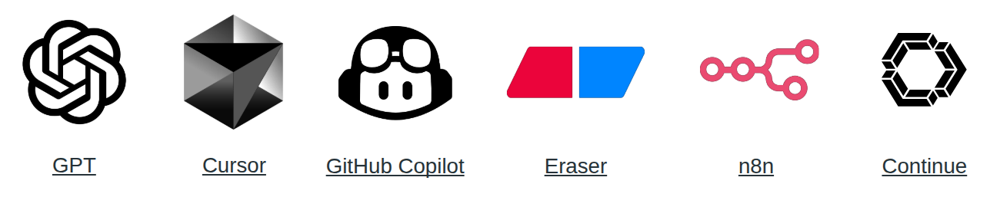

# Target Audience

This guide is developed primaevally for developers and QA engineers, in order to improve their productivity with AI.

# Why may it be for you

1. Respectful for your time - the material is structured to small videos and short articles.
2. All practical knowledge you have to know in 2025.
3. Practical examples and prompts to reuse.

# Structure

- documentation folder - contains all the documentation and examples listed in the presentation.
- [Presentation.pdf](Presentation.pdf) - the presentation PDF file.

# Why it was created

The reason I developed this guide, is to help my friends and colleagues to improve their productivity with AI. I see 
that many people still struggle with AI or do not know how to use it effectively, so I hope this guide will help 
people with this.

This is my first YouTube video, and a big step for me personally making it.
I hope this guide will help you, enjoy your time 🙂.
