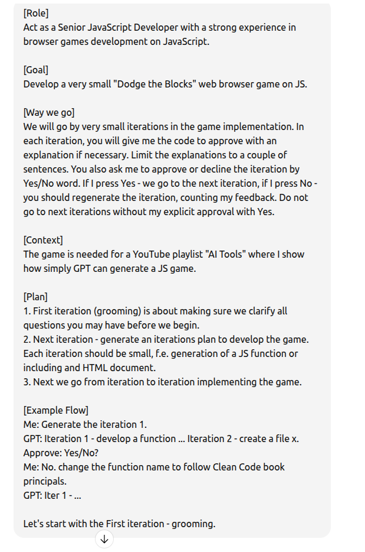

# Dodge the Blocks — Implementation Guide

This guide explains a step-by-step workflow to implement the "Dodge the Blocks" game and demonstrates how to apply prompting and refinement techniques to a real project.

## Overview
Follow the sequence below: create the prompt, groom the requirements, build an implementation plan, implement iteratively, and test the result. Each step includes example assets (images and text) stored in this folder.

---

## Step 1 — Develop the prompt
Create a concise prompt that explains the goal, constraints, and the expected output format.

Text version of the prompt : [InitialPrompt.txt](./prompts/InitialPrompt.txt)

---

## Step 2 — Grooming
Run a grooming session (examples below). Use these images as examples of how to guide clarifying questions and acceptance criteria.

---

## Step 3 — Implementation plan
Create a small, testable plan with 3–6 iterations. Example:

---

## Step 4 — Implement iteratively
Follow the implementation plan and ship one small change per iteration. Keep each change verifiable (one behavior, one test).

(Reference image: `./prompts/ImplementationPlan.png`)

---

## Step 5 — Test the result
After implementing the iterations, test the game. Example final screenshot:

---
