# Prompting Techniques

## Overview

This document summarizes practical prompting techniques for working with large language models (LLMs). Use this as a 
quick reference while developing or running GPT-based projects.

## Best practices
1. Keep conversations and context under ~32,000 tokens when possible. See documentation: `32000Tokens.pdf` and 
`32000Tokens.txt`. Example - [32000Tokens.txt](32000Tokens.txt).
2. Treat each feature or task as a separate GPT project.
3. Role prompting - f.e. "You are a Senior Frontend Engineer."
4. Be specific: give concrete requirements. 
5. Provide context. 
6. Specify desired output format, and examples. 
7. Start with Refinement session. 
8. Prefer structured prompts (role, context, instruction, constraints, examples, output schema). 
9. Use iterative refinement: ask for a plan, then request step-by-step execution.

## Context chunking — how to handle huge projects.
1. Embeddings -> Vector DB

### User Request Diagram

```mermaid
flowchart LR
subgraph Indexing
U1[🧑‍💻 User Query - 'What is vector database'] --> E1[🧩 Text Embeddings - Convert text to vectors]
E1 --> V[🧠 Vector Database - Store semantic meaning of 'What is vector database']
end

subgraph Retrieval_and_Augmentation
U2[💬 New Query - 'Add visualizations to the answer'] --> E2[🧩 Text Embeddings - Convert text to vectors]
E2 -->|🔎 Semantic Search| V
V --> C[📚 Top-K Similar Contexts - e.g. previous query 'What is vector database']
C --> P[🧱 Augmented Prompt - Combine new query with retrieved context]
P --> LLM[🤖 LLM such as ChatGPT]
LLM --> OUT[✅ Context Aware Response - Uses old context to answer new question]
end
```

2. Summarization layers 
3. Hierarchical chunking

## Example realization in the JS Game

### Create a project

### Prompt that realize all the rules

Text version of the prompt - [InitialPrompt.txt](prompts/InitialPrompt.txt)

---
