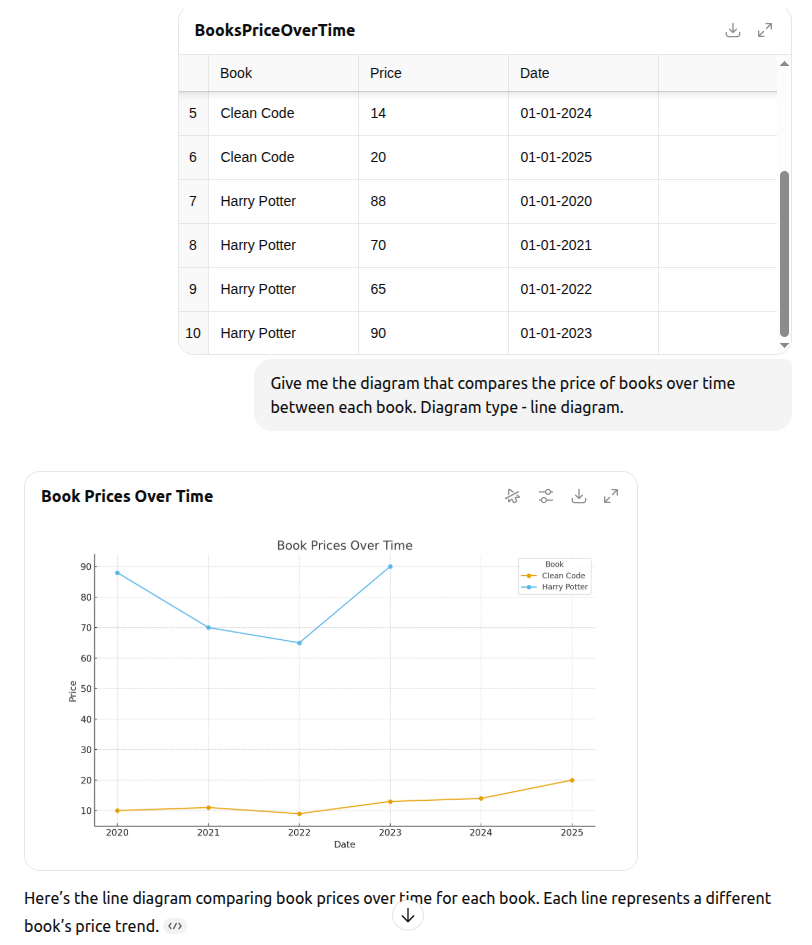
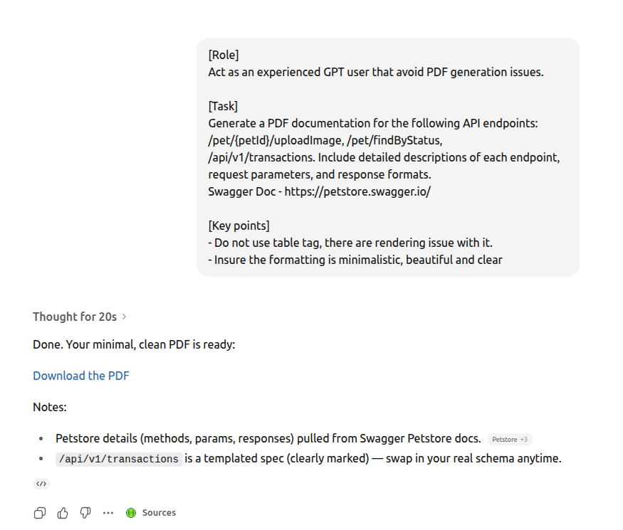
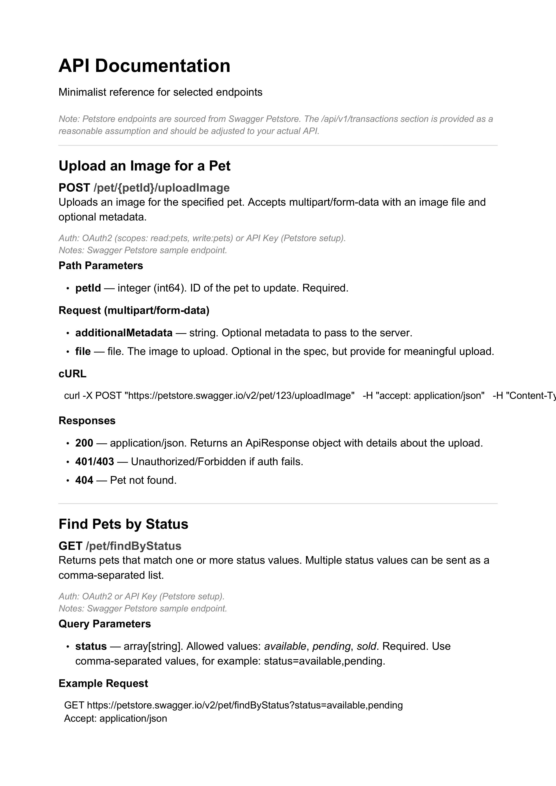
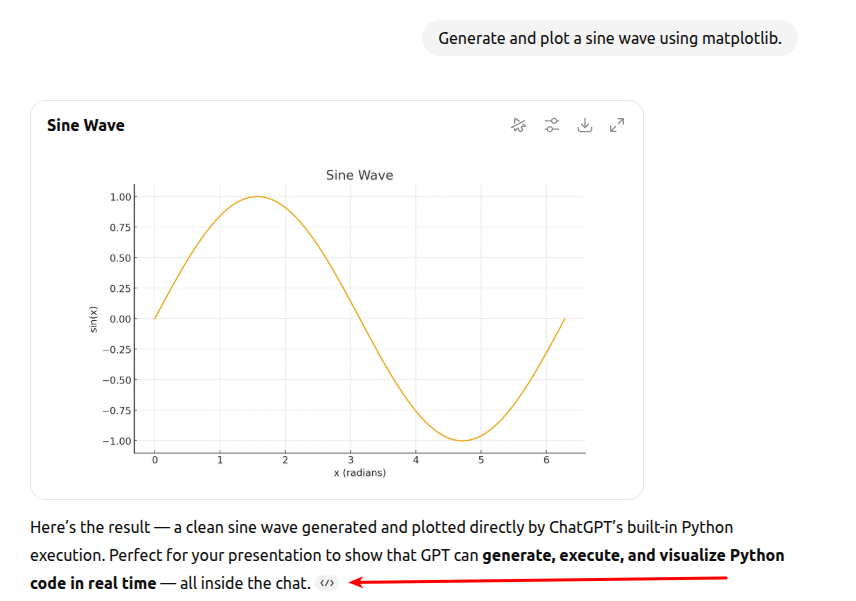
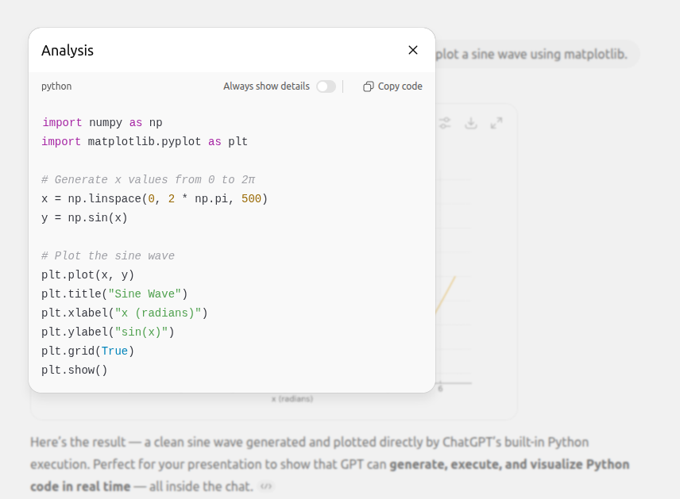

# ChatGPT Capabilities

This guide explains not trivial ChatGPT features that may be beneficial for developers and QA.

## File processing and generation
Gpt is native to process any text file formats or images that contains text data, especially: .txt, .csv, PDF, etc. It is also good at generation simple diagrams.

### Example 1 - Generate a diagram from a CSV file

Given: [BooksPriceOverTime.csv](BooksPriceOverTime.csv)

Prompt: 
```
Give me the diagram that compares the price of books over time between each book. Diagram type - line diagram.
```

Result:



### Example 2 - Generate a PDF documentation



Prompt as text: [PdfDocumentationPrompt.txt](PdfDocumentationPrompt.txt)

Result:



Link to the full PDF - [APIEndpointsDocumentation.pdf](APIEndpointsDocumentation.pdf)

## Python code execution
ChatGPT can actually run Python code in real time — not just generate it. It’s great for testing snippets, analyzing data, visualizing charts, or debugging logic.

Example 1 - Generate a diagram.

Prompt: `Generate and plot a sine wave using matplotlib.`

Result:



