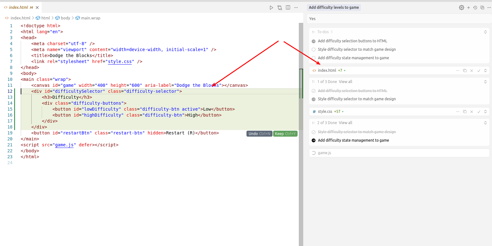

# Cursor - AI-powered code editor / Pair Programmer

This guide is a very short preview of the Cursor capabilities for developers and QA.

## What is Cursor

Cursor is an AI-powered code editor with a built-in pair programmer.

## Key Features

1. Automatic code changes. Can automatically change project files and execute terminal commands that were allowed.

2. Privacy mode - Can be turned on to prevent data usage in the model training.

3. Rules & Memories - Repetitive prompts automatically counted in each project. Can be used to enforce coding standards and best practices.

### Example Usage - Game Difficulty Levels Development

