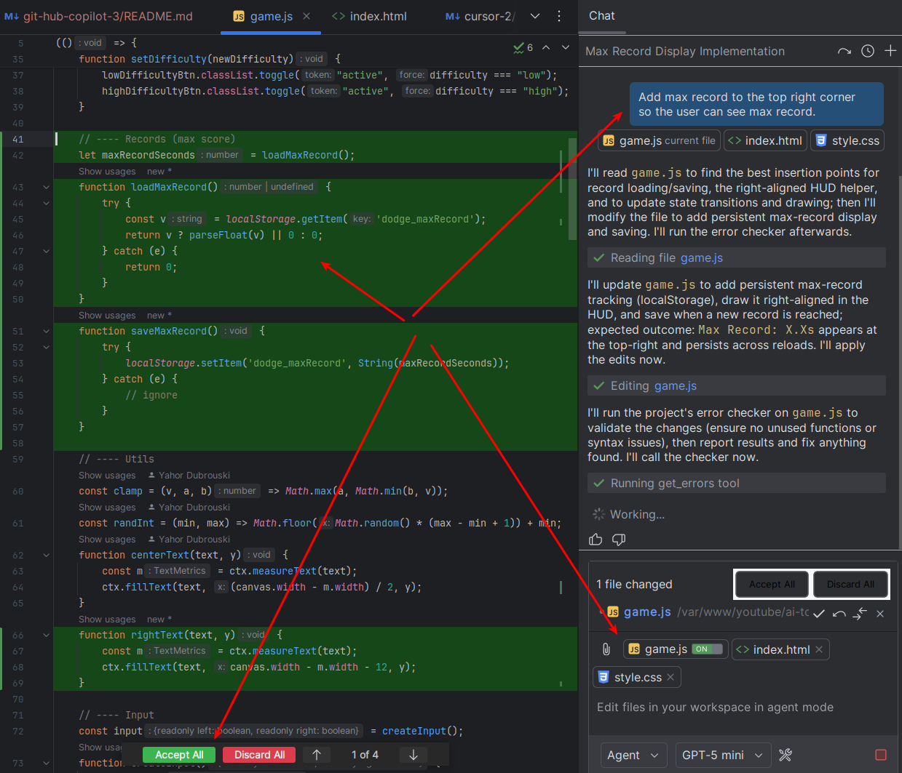

# GitHub Copilot - Another AI-powered code editor / Pair Programmer

This guide is a very short preview of the GitHub Copilot capabilities for developers and QA.

## What is GitHub Copilot

GitHub Copilot is an AI-powered code editor with a built-in pair programmer.

## Key Copilot Features to compliment Cursor and Gpt

1. Only opened files are in the context by default, so it's more secure.
2. You can choose any model (GPT-4o, Claude, Gemini, local Llama).
3. Better for small code changes, f.e. fixing a bug in a class or method.

## Example Usage - Max Record Development

