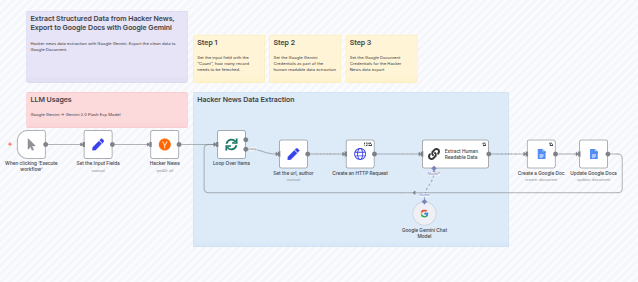

# n8n - workflow automation tool.

This guide is a very short preview of the n8n capabilities.

## What is n8n

n8n is a workflow automation tool that allows users to connect different apps and services to automate repetitive tasks 
without extensive coding.

## Key features

1. No code required.
2. Zero time on infrastructure setup.
3. Very fast to develop new integrations.
4. Support all LLMs and AI models.
5. Many pre-build solutions for vide/audio/text/image processing with AI.

## Example use case 1 - Voice-to-Task Manager

[Link to the automation](https://n8n.io/workflows/7925-voice-to-task-manager-with-telegram-gpt-4o-and-notion-database/)

## Example use case 2 - Extract & Transform HackerNews Data to Google Docs

[Link to the automation](https://n8n.io/workflows/5677-extract-and-transform-hackernews-data-to-google-docs-using-gemini-20-flash/)
